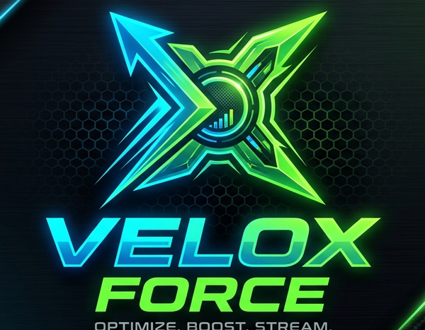
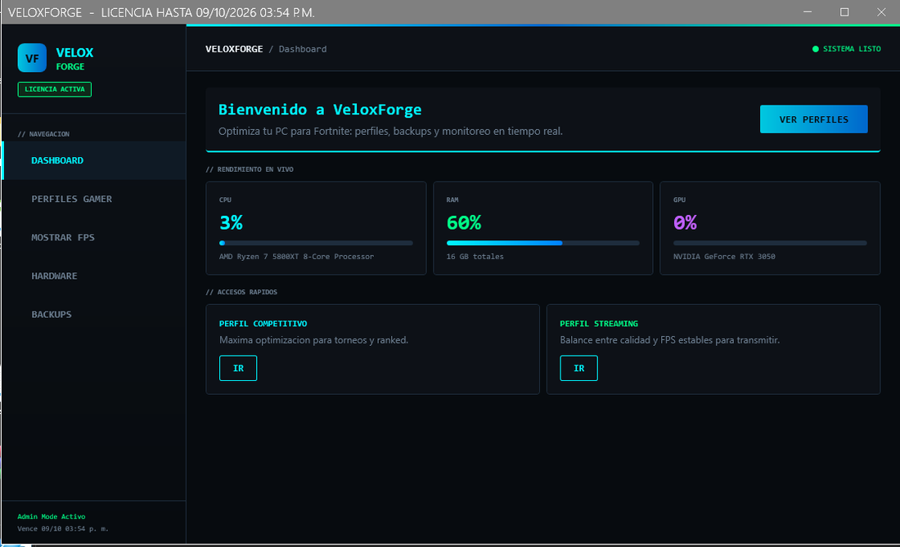
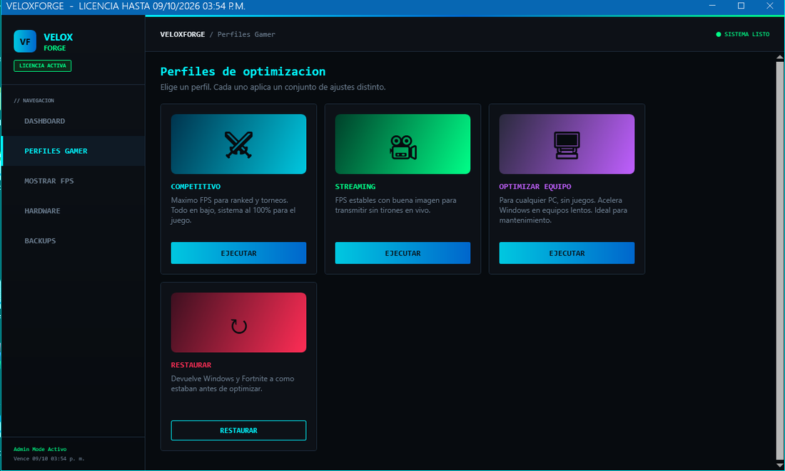
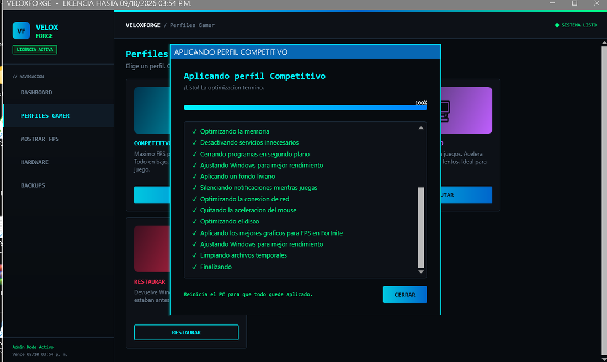
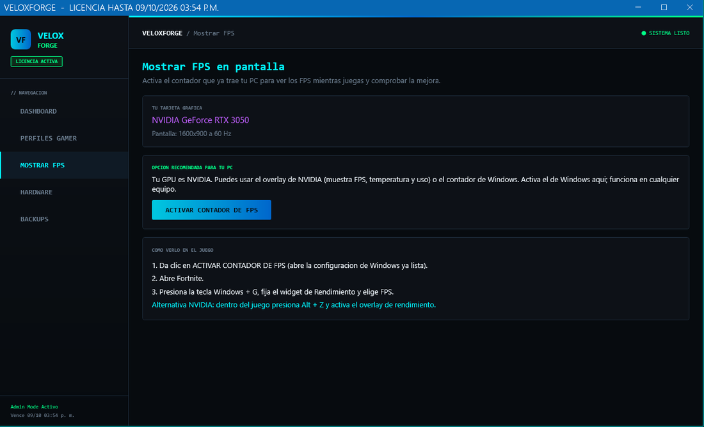

<div align="center">



# Velox Force

**Optimizador de rendimiento para PC gamer, con enfoque en Fortnite.**

Aplicación de escritorio en C# / WPF que aplica optimizaciones reales de Windows,
monitorea el hardware en tiempo real y gestiona licencias por equipo.


</div>

---

## ¿Qué es?

**Velox Force** es un optimizador de Windows que mejora el rendimiento del equipo
para juegos (en especial Fortnite) aplicando ajustes reales al sistema y al juego,
de forma segura y reversible. Está pensado tanto para jugadores como para técnicos
que hacen mantenimiento de equipos.

A diferencia de un simple "limpiador", Velox Force muestra lo que está haciendo con
una interfaz clara, monitorea el hardware en vivo y permite **deshacer todos los
cambios** con un clic.

> **Nota:** Este repositorio es una vitrina del proyecto. Por seguridad, el generador
> de licencias y las claves privadas **no se incluyen**. Si quieres ver esas partes o
> una demo privada, escríbeme (contacto abajo).

---

## Capturas

<div align="center">

| Dashboard con métricas en vivo | Perfiles de optimización |
|:---:|:---:|
|  |  |

| Ejecución con progreso | Mostrar FPS en pantalla |
|:---:|:---:|
|  |  |

</div>

---

## Funcionalidades

- **Dashboard en tiempo real** — uso de CPU, RAM y GPU leído directamente del sistema (WMI), actualizándose cada pocos segundos.
- **Perfiles de optimización** con un clic:
  - **Competitivo** — máximo FPS para ranked y torneos (19 ajustes de sistema + configuración gráfica de Fortnite).
  - **Streaming** — balance calidad/FPS para transmitir sin tirones.
  - **Optimizar equipo** — acelera cualquier PC lento, sin juegos (ideal para mantenimiento).
  - **Restaurar** — revierte el sistema a sus valores por defecto.
- **Mostrar FPS** — activa el contador de FPS que ya trae Windows (Game Bar) o el overlay de NVIDIA, detectando el hardware.
- **Ventana de ejecución amigable** — muestra el progreso en lenguaje sencillo y oculta los detalles técnicos.
- **Backups automáticos** — guarda la configuración de Fortnite antes de modificarla.
- **Sistema de licencias por equipo** — activación controlada, atada al hardware (ver más abajo).

---

## Arquitectura

```
Velox Force (WPF .NET 10)
├── UI (una sola ventana + páginas)
│   ├── Dashboard        → métricas en vivo (WMI)
│   ├── Perfiles Gamer   → tarjetas de optimización
│   ├── Mostrar FPS      → activación de overlays
│   ├── Hardware         → info del equipo
│   └── Backups          → copias de GameUserSettings.ini
│
├── Servicios
│   ├── HardwareMonitor  → lectura de CPU/RAM/GPU vía WMI
│   ├── LicenseService   → validación de licencias firmadas (offline)
│   └── ExecutionWindow  → ejecuta scripts y muestra progreso amigable
│
└── Scripts (PowerShell)
    ├── Optimización de sistema (energía, servicios, red, registro...)
    └── Configuración de Fortnite (escritura segura del .ini por secciones)
```

El trabajo pesado lo realizan **scripts de PowerShell** orquestados desde C#. La app
captura su salida y la traduce a pasos legibles, aplicando siempre una copia de
seguridad previa.

---

## Cómo funciona el sistema de licencias

Uno de los retos más interesantes del proyecto fue distribuir la app de forma
controlada **sin depender de un servidor**. La solución usa **firma digital** y
**huella de hardware**:

1. La app genera un **código de equipo** a partir de una huella única del PC (placa, CPU, disco).
2. Ese código se envía por WhatsApp; el autor genera un **código de activación firmado** con una llave privada (ECDSA P-256).
3. La app verifica la firma con la **llave pública** incluida en ella. No puede fabricar licencias, solo validarlas.
4. La licencia queda **atada a ese equipo** y con **fecha de vencimiento**; alterar el reloj de Windows no la extiende.

Esto permite licencias temporales (por ejemplo, 3 días) que no se pueden rotar entre
equipos, todo sin infraestructura de servidor.

---

## Tecnologías

| Área | Stack |
|---|---|
| Lenguaje | C# |
| UI | WPF + MahApps.Metro |
| Framework | .NET 10 |
| Hardware | WMI (System.Management) |
| Automatización | PowerShell |
| Seguridad | Criptografía ECDSA (firma de licencias) |
| Distribución | Inno Setup (instalador self-contained) |

---

## Instalación (usuarios)

1. Descarga el instalador `VeloxForceSetup.exe` desde la sección [Releases](../../releases).
2. Ejecútalo e instala (requiere permisos de administrador para aplicar optimizaciones).
3. Abre Velox Force e ingresa tu código de activación.

No requiere tener .NET instalado: el instalador es autocontenido.

---

## Seguridad y responsabilidad

- Antes de modificar la configuración de Fortnite, la app crea una **copia de seguridad**.
- El perfil **Restaurar** devuelve Windows y el juego a sus valores por defecto.
- Las optimizaciones se centran en ajustes seguros y reversibles. Los cambios de hardware (overclock, etc.) quedan fuera por diseño.

---

## Autor

**Nelson Andrés Gil Gutiérrez**
Ingeniero de Sistemas · Desarrollador de software · Armenia, Colombia

- 💼 LinkedIn: [tu-perfil-de-linkedin]
- 📧 Correo: [tu-correo]
- 💬 Para ver el código completo o una demo privada, contáctame.

---

<div align="center">
<sub>Proyecto desarrollado de forma independiente como parte de mi portafolio.</sub>
</div>
